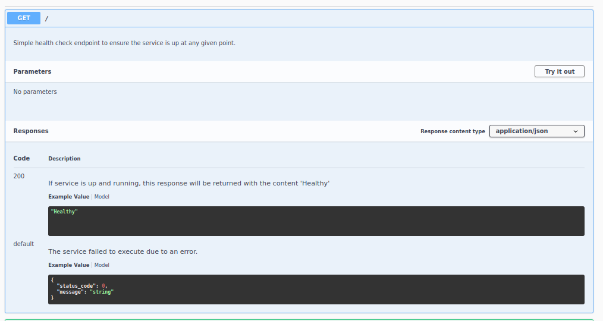

# AutoML-Pipeline-Project
The current project is about bank customers classification, this means we decide whether we provide a loan to a given customer or not depending on the information we have about the person, for this we train a machine learning model to help us to make this decision.
In this project we using Azure Machine Learning Studio, we will train a model using the [bank-marketing](https://automlsamplenotebookdata.blob.core.windows.net/automl-sample-notebook-data/bankmarketing_train.csv) dataset and we deploy it as http endpoints to be served to the outside world. As an alternative we will do the same steps using Azure ML Python SDK to train and publish our best model, the major advantage of this method is writing our configuration as code which makes it easy to share with others and to add future improvements.
## Installation
**Note: These instructions tested for ubuntu 20.04**
* Create Python3 virtual environment:
`$ python3 -m venv azureml-env`
* Enable the virtual environment:
`$ ./azureml-env/bin/activate`
* Install docker:
`sudo apt-get install docker.io`
* Install [azure cli](https://docs.microsoft.com/en-us/cli/azure/install-azure-cli-linux?pivots=apt)
* Install [Azure Python SDK](https://docs.microsoft.com/en-us/python/api/overview/azure/ml/install?view=azure-ml-py)
## Architectural Diagram
The following picture represents an architectural diagram of the project, which shows it's different stages.

* **Authentication:**
Authenticate to AutoML in order to enable ressources creation and manipulation.
* **Configure AutoML:**
Configure the different AutoML parameters like the task type, the dataset, the primary metric, the steps..etc.
* **Determine best model using AutoML:**
Launch AutoML pipeline and create the runs to get the best algorithm that works best for our problem.
* **Deploy best model:**
Get the best model and deploy it as pipeline endpoints to serve it via http.
* **Consume the model:**
Consume the deployed model using Python Sdk or any other http client.
## Key Steps
### Deploy model in Azure ML Studio
* The bank-marketing dataset

* The completed AutoML experiment and the different metrics

* Model deployment showing application insights enabled

* Running `logs.py` logs

* The swagger api endpoints with two endpoints

* The Get / endpoint

* The Post /score endpoint

* Interaction with the endpoints

* Running Apache benchmarks results

### Publish an ML Pipeline
* The created AutoML pipeline

* Published pipeline overview

* The use of RunDetails Widget

* The deployed pipeline endpoint

* The experiment showing completed

## Screen Recording
For a live demo refer to this [screen recording](https://youtu.be/9waMcUfV0Hs) of the project, the screencast demonstrates:
* The working deployed ML model endpoint.
* The deployed Pipeline
* Available AutoML Model
* Successful API requests to the endpoint with a JSON payload
* The Jupyter Notebook
## Standout Suggestions
* **Enable training with new data:** As part of the CI/CD pipeline it will be perfect to set up a webhook triggered when we have new data published to our bank marketing dataset(which we could host in git repository).
* **Try different AutoML configurations:** The current best model selected is able to reach 0.91 accuracy, exploring more configurations related to AutoML is a potential improvement that could lead to a better performance.
* **Balance the dataset:** The bank marketing dataset used is imbalanced, even though using AUC_weighted is helping to overcome the problem that could be caused by this, but exploring other solutions could give better results.
